# Zigbee a Raspberry Pi 4: Průvodce zavedením komponent a  naimplementovaných funkcí

### Komponenty
Všechny níže zmíněné součásti by měli být součástí kitu. Pokud bude některá chybět, prosím kontaktujte mě a domluvíme se na náhradě.
### Raspberry Pi 4
Tento jednodeskový počítač je základem celého automatizovaného řešení. V této implementaci slouží jako server, na kterém bude bežet služba Zigbee2MQTT. Počítač by se měl nacházet v ochraném pouzdru. Pro účely názornosti budou použity obrázky bez pouzdra, viz následující obrázek.

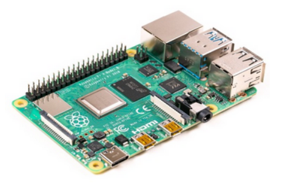
### Zigbee USB dongle
Jedná se o koordinátor pro bezdrátovou komunikační technologii Zigbee. Po připojení do Raspberry Pi slouží jako ovladač chytrých komponent.

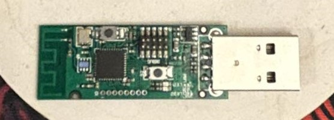
### MikroSD
Obsahuje software Home Assistant, který integruje automatizace a slouží pro řízení chytrých zařízení. 
### USB-C kabel + Adaptér
Tyto prvky slouží k zajištění napájení Raspberry Pi 4

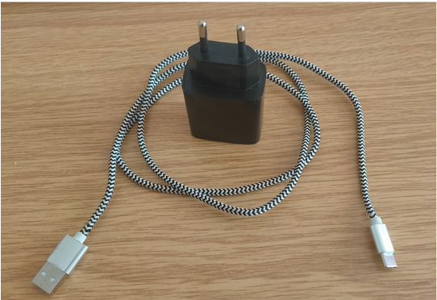
### Síťový ethernet kabel
Kabel k propojení Raspberry Pi 4 s domácí sítí
### Multifunční kostka Aqara
Tato kostka funguje jako dálkový ovladač, který reaguje na předem naprogramované pohyby. Mezi tyto pohyby patří:
Dvojité poklepání
* Vodorovné otočení doprava a doleva
* Překlopení kostky o 90°
* Překlopení kostky o 180°
* Posun kostky po ploše
* Zatřepání kostkou

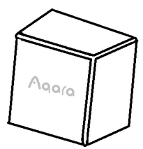
### Magnetický senzor ZC-M1
Senzor se skládá ze dvou částí, magnetu a samotného senzoru. Senzor je ve stavu zavřeno, pokud se nachází v magnetickém poli. Pokud se od se be součásti vzdálí, změní se stav senzoru na otevřeno.

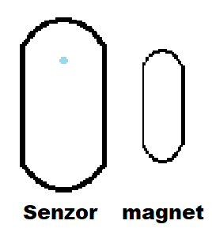
### LED žárovka IKEA TRÅDFRI
Žárovka s nastavitelným jasem a barvou.

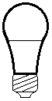

### Adaptér pro napájení žárovky ze zásuvky
V případě, že LED žárovka nepasuje do žadné dostupné objímky, lze použít tento adaptér.

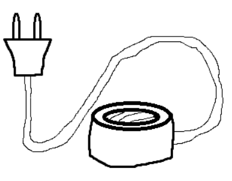

## Zavedení komponent
Tato kapitola poskytuje návod na zprovoznění jednotlivých komponent, aby je bylo možné používat v automatizacích. Pokud při plnění postupu narazíte na problém, kontaktujte mě prosím a společně problém vyřešíme.
### Zprovoznění Raspberry Pi 4
Raspbery Pi 4 (dále RP4) a jeho součsti by měli být předem nastaveny. 
Postup pro zprovoznění RP4 je následující:
* Vsuňte SD kartu do příslušného slotu na RP4.

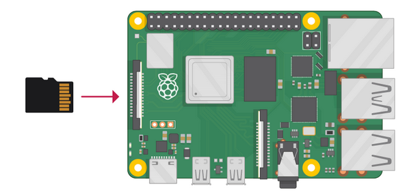

* Připojte jeden konec ethernet kabelu do Vaší domací sítě, například routeru.

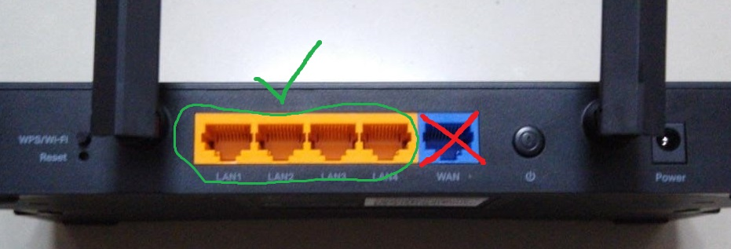

* Druhý konec ethernet kabelu připojte do RP4.

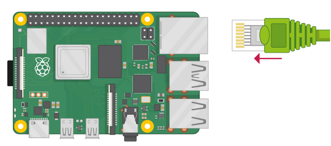
* Připojte Zigbee USB dongle do jednoho z USB portů.
* Připojte napájení kabelem USB-C.

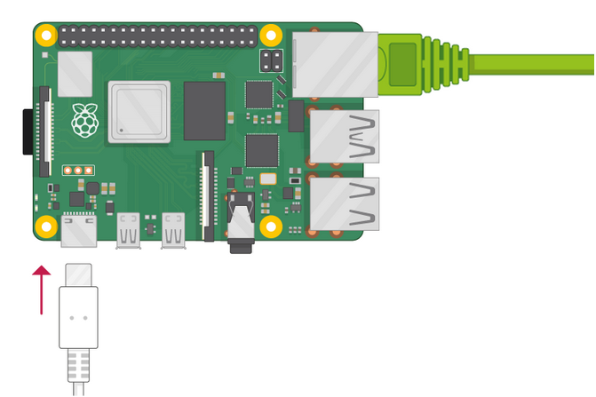
* Druhý konec připojte pomocí adaptéru do zásuvky.
* Poté začně blikat dioda RP4, což značí, že komponenta byla úspěšně připojena. 

## Zprovoznění Zigbee prvků
### Multifunční kostka Aqara
* Pomocí přiloženého nástroje odstraňte zadní stěnu kostky. Tato stěna na sobě bude mít symbol vykřičníku v trojuhelníku
* Zkontrolujte, že kostka má v sobě baterii.
* Pokud baterie chybí, vložte knoflíkovou baterii CR2450, která je součástí balení.
* Podržte tlačítko u nápisu **LINK** podobu 5 sekund.
* Rozblikání LED diody značí, že došlo k propojení.
* Vraťte zadní stěnu na její původní místo
> [!WARNING]
> Ujistěte se, že je stěna řádně zacvaknuta, aby nedošlo k jejímu uvolnění při manipulaci s kostkou. ! 
* Nyní lze kostku používat jako ovladač.

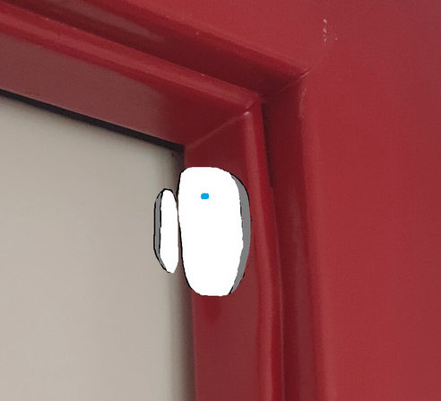

### Magnetický senzor ZC-M1
* Odejměte zadní kryt senzoru.
* Zkontrolujt, že senzor má v sobě baterii.
* Pokud baterie chybí, vložte knoflíkovou baterii CR2032, která je součástí balení.
* Vraťte zadní kryt na jeho původní místo.
* Podržte tlačítko na horní straně senzoru po dobu 6 sekund.
* Rozblikání LED diody značí, že došlo k propojení.
* Připevněte senzor na rám dveří/okna.
* Ve stejné výšce připevněte magnet na dveře/okno tak, aby obě části byli v kontaktu, když jsou dveře zavřené.
* Nyní  bude senzor odesílat informace o aktuálním stavu dveří.

### LED žárovka IKEA TRÅDFRI
> [!WARNING]
> Nebezpečí elektrického úrazu !
> Před manipulací s objímkou ji odpojte od přívodu elektrického proudu a ujistěte se, že objímka není pod proudem

* Vyhledejte objímku, do které bude žárovka pasovat.
* Pokud nenajdete potřebný druh objímky použijte adaptér pro napájení žárovky.
* Vypněte přívod elektrického proudu do objímky přepnutím vypínače nebo odpojením ze zásuvky.
* Zašroubujte žárovku do objímky.
* Zapněte přívod elektrického proudu.
* Nyní bude žárovka reagovat na podněty automatizace.

## Implementované funkce
### Nastavení jasu žárovky podle stavu okna
Senzor je nainstalován na okenní rám, tak aby byl v kontaktu s magnetem, který je uchycen an okně. Žárovka je zašroubována v objímce a má přívod elektrického proudu. Pokud je okno otevřeno sníží se jas žárovky, aby světlo nepřilákalo okolní hmyz. Pokud je okno znovu zavřeno jas se vrátí na hodnotu před otevřením okna.
> [!NOTE]
> Jas se změní jen pokud žárovka svítí

### Přepíná stavu žárovky dvojitým poklepáním kostkou
Žárovka je zašroubována v objímce a má přívod elektrického proudu. Dvojitým poklepáním kostkou dojde k vypnutí/zapnutí žárovky.  Zároveň dojde k nastavení barvy a jasu na počáteční hodnoty.

### Korigování jasu žárovky pomocí otáčení kostkou
Žárovka je zašroubována v objímce a má přívod elektrického proudu. Dvojitým poklepáním kostkou dojde k vypnutí/zapnutí žárovky. Vodorovným otáčením kostky doprava se zvyšuje jas žárovky. Vodorovným otáčením kostky doleva se snižuje jas žárovky.
> [!NOTE]
> Žárovka musí svítit aby došlo ke změně jasu

### Změna barvy žárovky převracením kostky o 90°
Žárovka je zašroubována v objímce a má přívod elektrického proudu. Dvojitým poklepáním kostkou dojde k vypnutí/zapnutí žárovky. Převrácením kostky o 90° se změní barva žárovky.

Barva světla záleží na horní straně kostky po převrácení viz diagram kostky.

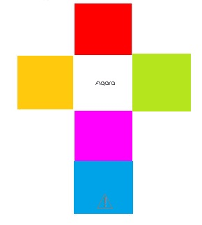

## Kontakt
Telefon: **731 860 678**

E-mail: **tomas.koten@tul.cz**

Discord: **Tomson#0694**

## Citace
### Kapitola: Zprovoznění Raspberry Pi 4
Název: **Vkládání SD karty do RP4**
Autor: Raspberry Pi Foundation
Odkaz: https://projects.raspberrypi.org/en/projects/raspberry-pi-setting-up/3
Copyright: CC BY-SA 4.0 Deed
https://creativecommons.org/licenses/by-sa/4.0/ 

Název: **Ethernet porty na routeru**
Autor: Abhi25
Zdroj: https://commons.wikimedia.org/wiki/File:TP-Link_AX1500_Wi-Fi_6_Router_Back.jpg
Copyright: CC BY-SA 4.0 Deed
https://creativecommons.org/licenses/by-sa/4.0/deed.en
Úpravy: zvýraznění důležitých částí

Název: **Připojení Ethernet kabelu do RP4**
Autor: Raspberry Pi Foundation
Odkaz: https://projects.raspberrypi.org/en/projects/raspberry-pi-setting-up/3
Copyright: CC BY-SA 4.0 Deed
https://creativecommons.org/licenses/by-sa/4.0/
Úprava: Odstranění nedůležitých kabelů

Název: **Připojení napájecího kabelu**
Autor: Raspberry Pi Foundation
Odkaz: https://projects.raspberrypi.org/en/projects/raspberry-pi-setting-up/3
Copyright: CC BY-SA 4.0 Deed
https://creativecommons.org/licenses/by-sa/4.0/
Úprava: Odstranění nedůležitých kabelů

 	

